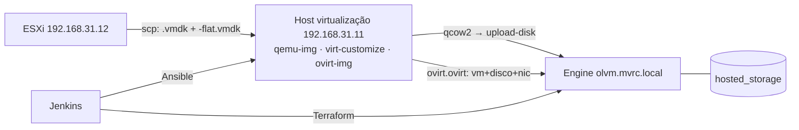

# convert-vmdk-vmware-olvm

Infraestrutura como Código para migrar VMs do **VMware vCenter/ESXi** para o
**Oracle Linux Virtualization Manager (OLVM / oVirt)** e para provisionar VMs
novas no OLVM.

Duas coisas, dois ferramentais, um pipeline:

| O quê | Ferramenta | Por quê |
|---|---|---|
| **Migrar** VMs do ESXi | Ansible | migração é procedimento ordenado, com efeitos colaterais |
| **Provisionar** VMs novas | Terraform | provisionamento é estado desejado |
| Orquestrar as duas | Jenkins | pipelines parametrizados, com aprovação manual no apply |

Este repositório também é **material de ensino**: o código é comentado em
português explicando *por que* cada decisão foi tomada, não só o que ela faz.

> **Repositório público.** Nenhum segredo em texto claro é versionado. Senhas vão
> em Ansible Vault ou credentials do Jenkins. Veja
> [Segredos](#segredos-repositório-público).

---

## Ambiente

| Componente | Endereço | Observações |
|---|---|---|
| Engine OLVM (hosted-engine) | `olvm.mvrc.local` → `192.168.31.9` | Oracle Linux 8, API + Keycloak |
| Host de virtualização | `192.168.31.11` | `qemu-img`, `ovirt-img`, `virt-customize`; NFS 2 TB em `/mnt/sd1` |
| ESXi de origem | `192.168.31.12` | datastore `VS2_HD2_1TB` |
| Storage domain de destino | `hosted_storage` | fase de migração |
| Datacenter / Cluster | `Default` / `Default` | |
| Usuário da API | `admin@ovirt@internalsso` | dois `@` — autenticação via Keycloak |

**DNS:** a zona `mvrc.local` roda num BIND9 (container no TrueNAS) que o roteador
não encaminha. Todo host que fala com o engine precisa de `/etc/hosts`:

```bash
echo '192.168.31.9  olvm.mvrc.local olvm' | sudo tee -a /etc/hosts
```

## Arquitetura em uma tela



Detalhes, diagramas e o registro das decisões:
[docs/architecture.md](docs/architecture.md).

## Quickstart

### Pré-requisitos

No host de virtualização (`192.168.31.11`):

```bash
dnf install -y qemu-img ovirt-imageio-client guestfs-tools python3-ovirt-engine-sdk4
mountpoint /mnt/sd1     # o NFS precisa estar montado
```

No runner do Jenkins (ou na sua estação): `ansible-core`, `terraform >= 1.3`,
`/etc/hosts` apontando o engine, e chave SSH para o host de virtualização e para
o ESXi.

### Migrar uma VM

```bash
cd ansible
ansible-galaxy collection install -r requirements.yml -p collections

# 1. segredos
cp group_vars/vault.yml.example group_vars/vault.yml
$EDITOR group_vars/vault.yml          # preencha vault_ovirt_password
ansible-vault encrypt group_vars/vault.yml

# 2. descobrir o firmware da VM (somente leitura no ESXi)
ansible-playbook precheck.yml -e vm_name=srv-app-01

# 3. declarar a VM em vars/vms.yml (nome, discos, firmware, CPU, memória)

# 4. migrar
ansible-playbook migrate-single.yml -e vm_name=srv-app-01 \
  --vault-password-file ~/.vault-pass
```

Em lote: `ansible-playbook migrate-batch.yml --vault-password-file ~/.vault-pass`.

Tutorial completo, com as lições da migração manual e a tabela de problemas
conhecidos: [docs/migration.md](docs/migration.md).

### Provisionar uma VM nova

```bash
cd terraform

# 1. descobrir os UUIDs do ambiente (o provider só aceita UUID, não nome)
export OVIRT_PASSWORD='...'
./scripts/get-ovirt-ids.sh

# 2. configurar
cp terraform.tfvars.example terraform.tfvars
$EDITOR terraform.tfvars              # UUIDs e as VMs desejadas
export TF_VAR_ovirt_password='...'    # a senha NUNCA vai em arquivo

# 3. aplicar
terraform init
terraform plan
terraform apply
```

Com e sem template, cloud-init e a referência completa do módulo:
[docs/provisioning.md](docs/provisioning.md).

## O que este repositório assume (e você deve testar)

Cinco fatos aprendidos numa migração manual bem-sucedida estão codificados aqui:

1. **Cada disco VMware são dois arquivos** — `nome.vmdk` (descritor) e
   `nome-flat.vmdk` (dados). Copiar só um resulta em
   `Could not open backing file`.
2. **Conversão:** `qemu-img convert -f vmdk -O qcow2 -o compat=1.1`.
3. **O certificado do engine não tem o FQDN no SAN** → `ovirt-img` precisa de
   `--insecure` (contorno de fase, não destino).
4. **O firmware decide o boot.** Descubra com `grep -i firmware` no `.vmx`:
   saída vazia = BIOS. Mapa: `bios` → `q35_sea_bios`, `uefi` → `q35_ovmf`.
5. **A rede muda de nome** (`ens160` → `enp1s0`) e precisa ser corrigida
   **offline** com `virt-customize`, injetando netplan DHCP genérico
   (`match: name "en*"`). Se a VM subir sem rede, o Ansible não entra para
   consertar — é um impasse.

## Segredos (repositório público)

| Segredo | Onde mora | Como o pipeline recebe |
|---|---|---|
| Senha do engine (Ansible) | `ansible/group_vars/vault.yml` (Vault, gitignored) | `--vault-password-file` da credential `ansible-vault-password` |
| Senha do engine (Terraform) | credential do Jenkins | variável de ambiente `TF_VAR_ovirt_password` |
| UUIDs do ambiente | `terraform/terraform.tfvars` (gitignored) | credential `olvm-tfvars` (*Secret file*, opcional) |
| Chave SSH (host/ESXi) | credential do Jenkins | `sshagent(['olvm-ssh-key'])` |
| Senha para o `ovirt-img` | arquivo temporário `chmod 600` | criado e destruído em `block`/`always` |

Credentials que precisam existir no Jenkins:

- `ansible-vault-password` — *Secret file* com a senha do vault
- `olvm-ssh-key` — *SSH Username with private key*
- `olvm-api-password` — *Secret text* com a senha de `admin@ovirt@internalsso`
- `olvm-tfvars` — *Secret file* com o `terraform.tfvars` (opcional)

O `.gitignore` bloqueia `group_vars/vault.yml`, `*.qcow2`, `*.vmdk`, `*.pem`,
`*.key`, `*.tfvars`, `.terraform/`, `*.retry`, `.engine-pass` e `*.tfstate`.

## Estrutura

```
├── ansible/
│   ├── precheck.yml            # descobre firmware/SO no ESXi (somente leitura)
│   ├── migrate-single.yml      # migra 1 VM   (guarda anti-Jenkins)
│   ├── migrate-batch.yml       # migra N VMs  (guarda anti-Jenkins)
│   ├── tasks/migrate_one.yml   # orquestra as 4 etapas de uma VM
│   ├── roles/
│   │   ├── extract/            # scp do ESXi + qemu-img convert
│   │   ├── fix_network/        # virt-customize offline (netplan genérico)
│   │   ├── upload/             # ovirt-img upload-disk
│   │   └── create_vm/          # ovirt.ovirt: VM + discos + nic
│   ├── group_vars/all.yml      # configuração não-secreta
│   ├── group_vars/vault.yml.example
│   ├── vars/vms.yml            # fila de VMs a migrar
│   └── inventory/hosts.yml
├── terraform/
│   ├── main.tf                  # for_each sobre var.vms -> módulo
│   ├── modules/ovirt_vm/        # módulo reutilizável (template ou blank)
│   └── scripts/get-ovirt-ids.sh # descobre os UUIDs na API
├── jenkins/
│   ├── Jenkinsfile.migrate     # parametrizado por VM/firmware/CPU/memória
│   └── Jenkinsfile.provision   # init→plan→aprovação manual→apply
└── docs/                       # migration.md · provisioning.md · architecture.md
```

## A VM do Jenkins não é migrável por este pipeline

Ela executa o pipeline: migrá-la automaticamente derrubaria a própria execução no
meio, deixando disco meio copiado e VM meio criada. Três camadas de guarda
abortam se `jenkins` aparecer no nome — no Jenkinsfile (primeiro estágio), nos
playbooks (`pre_tasks`) e em `tasks/migrate_one.yml`.

O procedimento manual está em
[docs/migration.md](docs/migration.md#8-o-caso-especial-do-jenkins).

## Estado da validação

Validado nesta máquina, sem acesso ao OLVM:

- `ansible-playbook --syntax-check` nos três playbooks — OK
- execução real dos `pre_tasks` (guardas, resolução da VM, cálculo de alias/UUID
  dos discos) — OK; a guarda anti-Jenkins aborta como esperado
- `ansible-lint` (6.22.2, instalado num venv isolado) — **0 falhas no perfil
  `production`**, nos 15 arquivos de playbooks/roles
- `terraform init` / `validate` / `fmt -check -recursive` — OK
- `terraform plan` no modo mock do provider — OK (9 recursos planejados)
- atributos do provider conferidos contra
  `terraform providers schema -json` da versão 2.2.0 instalada
- `bash -n` no script de descoberta de UUIDs — OK
- `git check-ignore` em cada padrão sensível do `.gitignore` — OK

Os Jenkinsfiles **não** foram validados: exigem um controlador Jenkins para
`Declarative Linter`. Rode
`curl -X POST -F "jenkinsfile=<jenkins/Jenkinsfile.migrate" $JENKINS_URL/pipeline-model-converter/validate`
no seu controlador antes de confiar neles.

**Precisa ser testado contra o ambiente real** — não tenho acesso ao OLVM:

- autenticação do usuário Keycloak `admin@ovirt@internalsso` pelo SDK (Ansible) e
  pelo provider (Terraform)
- IDs de `operating_system` / `os_type` válidos na sua versão do engine
  (`other_linux`, `rhel_9x64`, `ubuntu_22_04`… a lista varia)
- comportamento do `--insecure` do `ovirt-img` contra o certificado sem SAN
- se o `virt-customize` reconhece o SO de cada qcow2 convertido
- o ajuste opcional de firmware via API REST (`firmware_apply_via_api`), que vem
  desligado por padrão
- o sufixo do arquivo de dados dos seus discos (assumido `-flat`; layouts thin
  podem usar `-sparse` ou `-s001`)

**Placeholders a preencher:** UUIDs de cluster/storage domain/vNIC
profile/template (`terraform.tfvars`), nome da rede lógica (assumido
`ovirtmgmt`), usuário SSH do ESXi (assumido `root`) e as VMs reais em
`ansible/vars/vms.yml` (o arquivo traz exemplos fictícios).

## Licença

[MIT](LICENSE).
