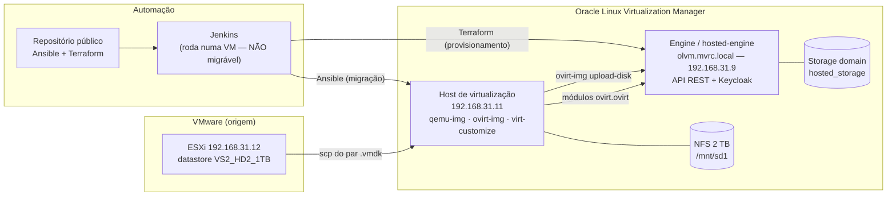
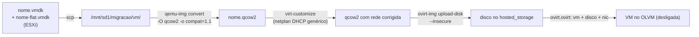

# Arquitetura e decisões

## 1. Topologia

Fluxo de um disco na migração:

## 2. Decisões

### D1 — Ansible para migrar, Terraform para provisionar

Migração é um **processo com etapas ordenadas e efeitos colaterais** (copiar,
converter, editar imagem, enviar): isso é procedimento, e Ansible descreve
procedimento bem. Provisionamento é **estado desejado** ("quero estas 3 VMs
com esta CPU"): isso é Terraform.

Tentar migrar com Terraform obrigaria a modelar cópia e conversão de disco como
recurso — e o `ovirt_disk_from_image` do provider exige que a imagem esteja na
máquina que roda o Terraform, o que faria centenas de GB atravessarem o runner
do Jenkins. No caminho do Ansible, o dado nunca sai do host de virtualização,
que é vizinho do NFS.

### D2 — Provider Terraform: `oVirt/ovirt` v2.2.0

Pesquisado, não assumido. É o provider mantido pela própria organização oVirt
([github.com/oVirt/terraform-provider-ovirt](https://github.com/oVirt/terraform-provider-ovirt)),
reescrita v2 baseada em `go-ovirt-client`. Versão fixada com `~> 2.2`.

Descartados: `imjoey/ovirt` (fork histórico) e `EMSL-MSC/ovirt` (origem do
projeto, mantido só como referência). Você vai encontrar os dois em tutoriais
antigos.

**Limitações confirmadas contra o schema do provider instalado** (não é
suposição — foi extraído com `terraform providers schema -json`):

| Limitação | Consequência no projeto |
|---|---|
| `ovirt_vm` **não tem** `bios_type`/firmware | Firmware vem do template; VM em branco herda o padrão do cluster. Há um caminho opcional via API REST no módulo, desligado por padrão |
| `ovirt_vm` **exige** `template_id` | VM em branco usa o data source `ovirt_blank_template` |
| `ovirt_nic` **não tem** `mac` (só no branch de dev) | MAC fixo só via Ansible (`ovirt.ovirt.ovirt_nic`, `mac_address`) |
| Sem data source para cluster/storage domain/vNIC profile | UUIDs entram como variáveis; use `terraform/scripts/get-ovirt-ids.sh` para descobri-los |

### D3 — Trabalhar em `/mnt/sd1/migracao`, pasta irmã

O oVirt gerencia diretórios nomeados por UUID dentro do storage domain e mantém
metadados próprios ali. Escrever nesses diretórios corrompe o domínio. Toda a
área de trabalho fica numa pasta irmã, e o único caminho de entrada de dados no
storage domain é a API (`ovirt-img upload-disk`).

### D4 — Corrigir a rede **offline**, antes do primeiro boot

Ao sair do VMware para o KVM, o nome da interface muda (`ens160` → `enp1s0`).
A configuração antiga referencia um nome que não existe mais: a VM sobe sem
rede — e sem rede o Ansible não entra para consertar. É um impasse.

A saída é `virt-customize` com a VM desligada, injetando um netplan que casa por
padrão (`match: name: "en*"`) em vez de nomear a interface. Também removemos
`70-persistent-net.rules` (que amarra o nome ao MAC antigo) e
`50-cloud-init.yaml` (netplan gerado pelo cloud-init com o nome antigo).

`LIBGUESTFS_BACKEND=direct` é obrigatório: sem isso o libguestfs tenta usar
libvirt e falha por permissão no host oVirt.

### D5 — UUID de disco determinístico

O UUID de cada disco vem de `"<vm>/<disco>" | to_uuid` (UUID v5: mesma entrada,
mesmo UUID). Ganhos: reexecutar não duplica disco, e a criação da VM anexa o
disco por ID em vez de procurar por nome — que seria ambíguo se dois aliases
coincidissem.

### D6 — `--insecure` é temporário, não é a arquitetura

O certificado do engine não traz o FQDN no SAN, então a verificação de hostname
falha. Tanto o Ansible (`ovirt_insecure`) quanto o Terraform
(`ovirt_tls_insecure`) estão em modo permissivo **nesta fase**. Os dois lados já
têm o caminho pronto para endurecer (`ovirt_ca_file` / `ovirt_tls_ca_files`)
quando o certificado for corrigido — veja `docs/provisioning.md`.

### D7 — Guardas anti-Jenkins em três camadas

A VM do Jenkins executa o pipeline. Migrá-la automaticamente significa desligar
a máquina que está rodando o playbook, no meio da execução. As camadas:

1. `jenkins/Jenkinsfile.migrate` — primeiro estágio, antes até do checkout
2. `migrate-single.yml` / `migrate-batch.yml` — nos `pre_tasks`
3. `tasks/migrate_one.yml` — quem chamar por outro caminho também é barrado

A lista fica em `guard_forbidden_names` (`ansible/group_vars/all.yml`).

### D8 — Segredos: nada em texto, nunca

O repositório é público. Senha do engine mora em Ansible Vault
(`group_vars/vault.yml`, ignorado pelo git) ou em credential do Jenkins. O
Terraform recebe a senha por `TF_VAR_ovirt_password`. O `ovirt-img` recebe por
arquivo temporário `chmod 600`, criado e destruído no mesmo bloco `block/always`
— por isso a senha nunca aparece no `ps` do host.

O `group_vars/vault.yml` é carregado **explicitamente** via `vars_files`, e não
por convenção: um arquivo em `group_vars/` só é automático se existir um grupo
com aquele nome no inventário, e não existe grupo `vault`.

## 3. Idempotência

| Etapa | Como pula trabalho já feito |
|---|---|
| `extract` | se o `.qcow2` existe, não copia nem converte; `creates:` no arquivo de dados |
| `fix_network` | arquivo-sentinela `.<disco>.netfix.done` |
| `upload` | consulta o alias no engine antes de enviar |
| `create_vm` | módulos `ovirt.ovirt` são declarativos por natureza |
| Terraform | o estado cuida disso |

## 4. Limites conhecidos

- **Estado do Terraform é local.** O `Jenkinsfile.provision` usa backend local:
  o `terraform.tfstate` fica no workspace e não sobrevive à limpeza dele.
  Configure um backend remoto antes de usar para valer.
- **`wait_for_ip` exige `qemu-guest-agent`** dentro da VM; sem ele o apply fica
  esperando até o timeout.
- **Migração é sequencial por opção.** Duas conversões de 200 GB no mesmo NFS
  costumam ser mais lentas que uma após a outra — e muito mais difíceis de
  depurar.
- **O ESXi só é acessado por `raw`/`scp`.** Ele roda BusyBox e não tem Python
  utilizável para módulos Ansible.
